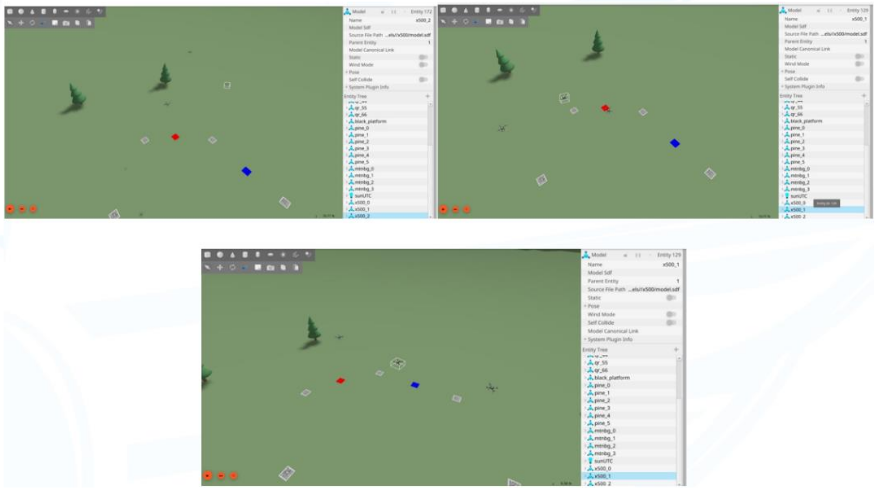
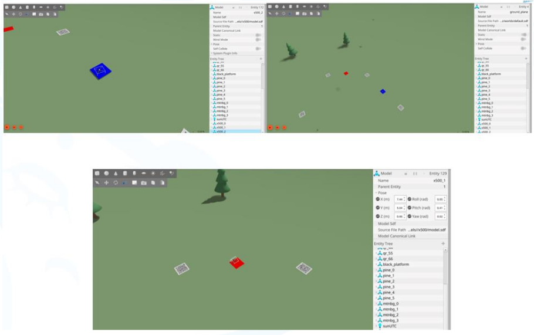
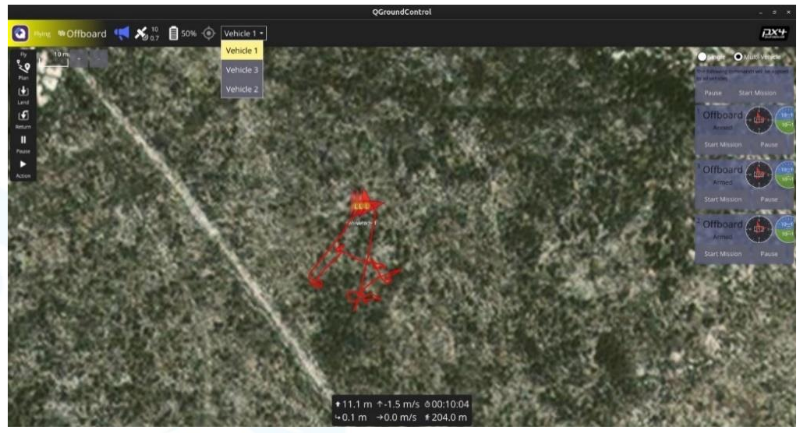

<h1 align="center"> SWARM UAVs — Gazebo PX4 SITL Simulation & Image Processing</h1>

<p align="center">
  <b>A decentralized 3× drone autonomous swarm</b> flying in <b>Gazebo SITL</b> on <b>PX4 Offboard</b>,
  coordinating peer-to-peer over <b>ROS 2</b>, with onboard <b>OpenCV image processing</b>
  (QR mission reading + color zone detection).
</p>

<p align="center">
  
  
  
  
  
  
</p>

---

##  Highlights

-  **Fully decentralized** — every drone runs its own ROS 2 agent and FSM; there is **no central commander**. The swarm coordinates through broadcast messages.
-  **Formation flight** — V / line formations with configurable altitude and spacing.
-  **Image processing** — OpenCV pipeline on each drone's downward camera:
  - **QR mission decoding** — the mission is read live from a QR code in the world.
  - **Color zone detection & fusion** — drones detect and agree on colored zones.
-  **Split → search → rejoin** — the formation can break apart to search and then reform.
-  **Collision avoidance & autonomous return**.
-  **One codebase for sim & real** — switch behavior with a single profile (`sitl` / `semi` / `real`).

---

## Gallery

Captures from the Gazebo SITL simulation and the image-processing output.

<p align="center">
  
  
</p>
<p align="center">
  
</p>

| Image | What it shows |
|-------|---------------|
| `Formations.png`    | The swarm holding formation in flight |
| `Blue_Red_Area.png` | Color zone detection — blue/red areas |
| `QGC.png`           | QGroundControl view used to arm and take off the drones |

---

## Tech Stack / Versions

Developed & tested on this exact stack — matching it is recommended.

| Component | Version |
|-----------|---------|
| **OS** | Ubuntu 24.04 LTS (x86_64) |
| **ROS 2** | Jazzy Jalisco |
| **Gazebo** | Gazebo Sim 8.11.0 (Harmonic) — the new `gz sim` |
| **PX4-Autopilot** | `main` (SITL, airframe `4001`, model `gz_x500`) |
| **Micro XRCE-DDS Agent** | latest (`MicroXRCEAgent`, UDP `8888`) |
| **Python** | 3.12 |
| **OpenCV (cv2)** | 4.13.0 |
| **NumPy** | 1.26.4 |
| **QGroundControl** | AppImage (operator arm + takeoff) |
| **Build** | colcon (`ament_cmake` + `ament_python` + `rosidl`) |

---

##  Repository Layout

```
.
├── README.md
├── launch_swarm.sh            # one-command launcher (XRCE + PX4/Gazebo + agents + QGC)
├── start_multidomain.sh       # per-UAV DDS-domain launcher (multi-machine topology)
├── record_baseline.sh         # capture nominal behavior for regression
├── regression_logger.py
├── tools/zenoh/               # Zenoh bridge allowlist (/swarm/* only); drop the bridge binary here
├── docs/images/               # ← put your simulation screenshots here
└── src/
    ├── laplacian_interfaces/  # custom ROS 2 messages (ament_cmake / rosidl)
    │   └── msg/                # AgentState, Px4Status, QrDetection, ColorDetection, ...
    ├── laplacian_swarm/       # the swarm app (ament_python)
    │   ├── laplacian_swarm/    # nodes (see below)
    │   ├── config/             # vehicles.yaml, field.yaml, profile_*.yaml
    │   ├── launch/             # swarm_bringup.launch.py
    │   └── scripts/            # start_sitl_swarm*.sh
    └── px4_msgs/              # PX4 uORB ↔ ROS 2 messages (git submodule)
```

### Nodes (`laplacian_swarm`)
| Node | Role |
|------|------|
| `swarm_agent_node` | Decentralized per-drone brain / FSM (formation, separation, QR mission, color search, split/rejoin, return) |
| `px4_gateway_node` | The **only** node that touches `/fmu/*` (arm/offboard/setpoints) |
| `localization_node` | Converts PX4 GNSS → shared `FIELD_ENU` frame |
| `vision_node` | OpenCV QR + color detection from the downward camera |
| `mission_trigger` | One-shot START: latches formation / altitude / QR target |

---

##  Dependencies

```bash
# ROS 2 Jazzy core
sudo apt install ros-jazzy-desktop

# ROS ↔ Gazebo bridges + image transport + vision
sudo apt install ros-jazzy-ros-gz ros-jazzy-ros-gz-image ros-jazzy-cv-bridge

# message tooling + build tools
sudo apt install ros-jazzy-rosidl-default-generators ros-jazzy-std-msgs ros-jazzy-sensor-msgs \
                 python3-colcon-common-extensions python3-rosdep
```

**Python libs:** `opencv-python` (4.13.0), `numpy` (1.26.4), `pyyaml`, `setuptools`.

**External tools (installed separately):** PX4-Autopilot (SITL + Gazebo), Micro XRCE-DDS Agent, QGroundControl.

---

##  Build

```bash
# 1. Source ROS 2
source /opt/ros/jazzy/setup.bash

# 2. Clone (--recursive pulls in the px4_msgs submodule)
git clone --recursive https://github.com/Ibrahimumutdoruk/SWARM_UAVs_GazeboSimulation_PX4_SITL_ImageProcessing.git swarm_ws
cd swarm_ws
#   if you forgot --recursive:  git submodule update --init --recursive

# 3. Resolve deps + build
rosdep install --from-paths src --ignore-src -r -y
colcon build --symlink-install
source install/setup.bash
```

---

##  Run the Simulation

### One command
```bash
./launch_swarm.sh
```
This opens terminals and starts, in order:
1. **Micro XRCE-DDS Agent** — `MicroXRCEAgent udp4 -p 8888`
2. **PX4 SITL + Gazebo** — 3 drones (`uav0`, `uav1`, `uav2`)
3. **ROS 2 swarm agents + vision** — `profile:=semi`
4. **Mission trigger** — formation `V`, altitude `15 m`, spacing `5 m`
5. **QGroundControl** — Arm + Takeoff each drone

> In the `semi` profile the agents **never self-arm**: they wait disarmed until you **Arm + Takeoff** from QGroundControl, then the software claims Offboard and the mission runs autonomously.

### Manual (equivalent)
```bash
# T1
MicroXRCEAgent udp4 -p 8888
# T2
./src/laplacian_swarm/scripts/start_sitl_swarm.sh
# T3
source install/setup.bash
ros2 launch laplacian_swarm swarm_bringup.launch.py profile:=sitl   # or profile:=semi
# T4 — start the mission
ros2 run laplacian_swarm mission_trigger --ros-args -p formation:=V -p altitude:=15.0 -p spacing:=5.0
```

---

##  Configuration & Profiles

All config lives in `src/laplacian_swarm/config/`.

| File | Purpose |
|------|---------|
| `vehicles.yaml` | Per-UAV manifest: id, system_id, namespace, Gazebo spawn pose, slot, DDS domain, XRCE port |
| `field.yaml` | Field origin (lat/lon/alt) for the shared `FIELD_ENU` frame |
| `profile_sitl.yaml` | Full SITL — agents self-arm, simulated GNSS |
| `profile_semi.yaml` | SITL but operator arms via QGC (no self-arm) |
| `profile_real.yaml` | Real flight — arm/offboard from RC only, physical camera, F9P GNSS |

```bash
ros2 launch laplacian_swarm swarm_bringup.launch.py profile:=semi
```

> The `spawn_gz` poses in `vehicles.yaml` **must match** `PX4_GZ_MODEL_POSE` in `scripts/start_sitl_swarm.sh`.

---

## Networking — DDS vs Zenoh Bridge

The swarm can run in two network topologies. Both use the exact same nodes and code; only the transport changes.

| Mode | When | Transport |
|------|------|-----------|
| **Single shared DDS domain** | Default SITL on one machine (`launch_swarm.sh`) | All UAVs share one `ROS_DOMAIN_ID`; direct DDS discovery |
| **Per-UAV domain + Zenoh bridge** | Multi-machine / real-hardware topology (`start_multidomain.sh`) | Each UAV gets its **own** `ROS_DOMAIN_ID` (10/11/12) and its own uXRCE-DDS port (8888/8889/8890); no direct DDS discovery between UAVs |

### How the Zenoh bridge works

In the multi-domain mode there is **no shared DDS bus**. The only path between drones is one `zenoh-bridge-ros2dds` instance per domain. The bridge is allowlisted to carry **only** the `/swarm/*` topics (mission, agent_state, zone, zone_ack) across drones. Everything private to a drone — `/fmu/*`, `vision/*`, `control/*`, `localization/*`, `px4/*` — never leaves its own domain.

This mirrors the real hardware setup, where each drone is a separate computer on a Wi-Fi mesh (`bat0`) and the drones discover each other over Zenoh instead of plain DDS multicast. On the `real` profile this is selected by `network_mode: zenoh_bat0` in `profile_real.yaml`.

The allowlist lives in [`tools/zenoh/bridge_allowlist.json5`](tools/zenoh/bridge_allowlist.json5):

```json5
{
  plugins: {
    ros2dds: {
      allow: {
        publishers:  ["/swarm/.*"],
        subscribers: ["/swarm/.*"],
      },
    },
  },
}
```

### Running the Zenoh / multi-domain mode

1. Get the bridge binary — download `zenoh-bridge-ros2dds` (from the [eclipse-zenoh/zenoh-plugin-ros2dds releases](https://github.com/eclipse-zenoh/zenoh-plugin-ros2dds/releases)) and place it in `tools/zenoh/`.
2. Launch everything:
   ```bash
   ./start_multidomain.sh
   ```
   This starts, per UAV: a uXRCE-DDS agent on its own port, PX4+Gazebo, a Zenoh bridge bound to its domain with the `/swarm/*` allowlist, and the swarm nodes. One bridge per domain peers with the others to relay only the swarm topics.

Manual single-bridge example for one domain:
```bash
cd tools/zenoh
ROS_DOMAIN_ID=10 ./zenoh-bridge-ros2dds peer -d 10 -c bridge_allowlist.json5
```

---

##  Troubleshooting

- **Not all 3 drones spawn** → increase the `sleep 18` in `launch_swarm.sh` (3 PX4 + Gazebo need time on a laptop).
- **Agents idle after launch** → in `semi` profile you must Arm + Takeoff each drone from QGroundControl.
- **No PX4 topics** → confirm `MicroXRCEAgent udp4 -p 8888` is running and `px4_msgs` is built.
- **Camera topic missing** → install `ros-jazzy-ros-gz-image`; the bridge remaps the Gazebo camera to `/uavX/down_cam/image`.
- **Drones don't see each other in multi-domain mode** → make sure `zenoh-bridge-ros2dds` is in `tools/zenoh/` and a bridge is running for each domain; only `/swarm/*` crosses domains by design.

---


## Author

**Ibrahim Umut Doruk** · [@Ibrahimumutdoruk](https://github.com/Ibrahimumutdoruk)
